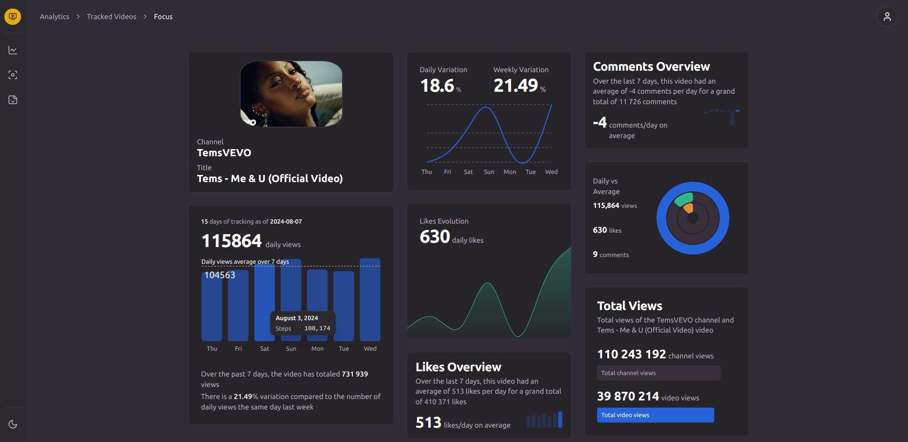

# Music Video Tracker

A multi tier, data oriented web application that lets you track your favorite YouTube music videos' statistics over time.
- [Try it here](https://caidam.github.io/project-project-front)
    > **Use username: `guest` and passsword: `guest` to access the website without creating an account.**

##

- Architecture

##

- Doc

  - [Technical Doc (in french)](./misc/public_mvt_dossier_projet.pdf)

- Repos
  
  - [Frontend Repo]()
  - [Backend Repo]()
  - [Data Processing Repo]()
  - [dbt Repo]()
